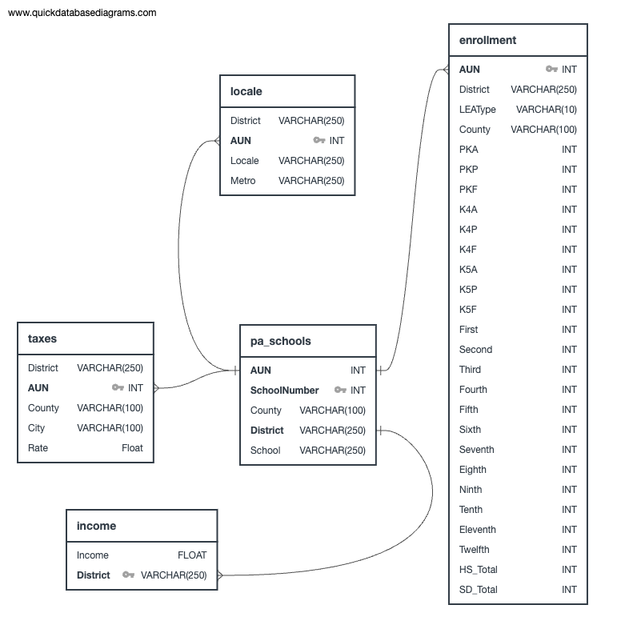

# UPenn-Data---Project-3
UPENN-VIRT-DATA-PT-06-2023-U-LOLC-MTTH Project 3 - Team 1

## Description
The purpose of this project is to collect and analyze PA school districts' Keystone testing results and the expdenditures per student, then use the data to create visualizations that show whether or not the amount of funding can account for the variance in testing scores across districts. The collected data is stored in a SQLite database and the project is powered by a Python Flask API which includees HTML/CSS and JavaScript programming to dislay the results on a webpage. The webpage structure is aimed at individual exploration of the data by migrating down the buttons in the menu pane. The visualizations begin at a high level, looking at all of PA, migrating down to a scatter plot and school district rankings, and finally looking at individual school distructs test results and expenditures. 

## Installation/Instructions
### Requirements
This script was tested using a development environment containing Python 3.11. The conda_env.txt and pip.txt files contained in the project files can be used to create the appropriate environments. In addition, the following dependencies are required to run various aspects of the project set up and deployment: Python: sqlalchemy and pandas; JavaScript: plotly, D3, JSCharting, and chart.js. 

### Installation
Clone this repo: `git clone https://github.com/4a6166/UPenn-Data---Project-3.git`

### How to Run
[app.py](./app.py) is the entry point for our flask app. To start the app, run the following command from inside the `flask` directory: <flask --app app.py --debug run>
To serve the files correctly, the command needs to be run from inside the flask directory. Doing flask --app flask/app.py run from the top level directory of the project will cause Flask to error out when trying to serve static files.

### Database
We used a SQLite database which can be found in the project files as [pa_school_district.db]. The schema charts are made with [QuickDBD](https://app.quickdatabasediagrams.com/), which has limitations on the number of tables in a single view.
Below are three PNGs with the schema and should be considered combined for query and reporting purposes.

- Factors Schema

- Finance Schema

- Scores Schema

### Output
This project creates a webpage which portrays several versions of chloropleth graphs, scatter plots, a slope chart, and radar and gauge graphs. 

## Credits
Data for this project was collected from various sources including:
- Department of Education - Data and Reporting
    - https://www.education.pa.gov/DataAndReporting/Pages/default.aspx
    - https://www.education.pa.gov/DataAndReporting/Assessments/Pages/Keystone-Exams-Results.aspx
- School district boundaries
    - https://data.pa.gov/Geospatial-Data/Pennsylvania-School-Districts-Boundaries/s629-r52w
- AFR Data: Summary Level Expenditure, revenue and tax information
    - https://www.education.pa.gov/Teachers%20-%20Administrators/School%20Finances/Finances/AFR%20Data%20Summary/Pages/AFR-Data-Summary-Level.aspx
- Local Earned Income Tax
    - https://smartasset.com/taxes/pennsylvania-tax-calculator?year=2019#us/income
- Best School Districts in PA Rankings 
    - https://www.niche.com/k12/search/best-school-districts/s/pennsylvania/

## Collaborators
GitHub usernames: 4a6166, katyphillips, mtguadamuzruth, Shikha0594, ryodaimatsui, mwiley608

## License
[MIT](LICENSE)
